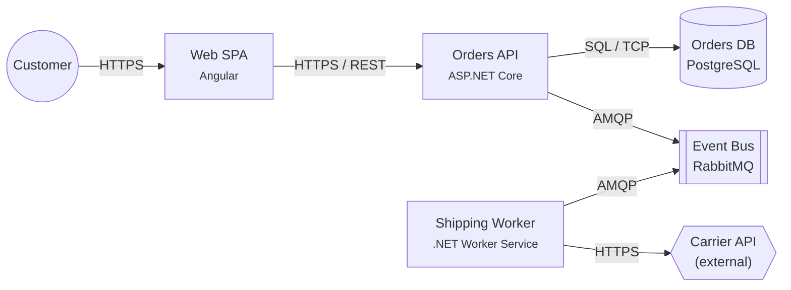

# Software Design Docs — C4, ADRs, and RFCs

Code tells you *what* the system does. Design docs tell you *why*. Without them, every onboarding costs a week of archaeology and every refactor risks re-opening a decision that was already considered and rejected. This file covers the three formats you will meet at a senior role: **C4** for visuals, **ADRs** for decisions, and **RFCs** for proposals.

## Why write them at all

- **Onboarding**: a new engineer can read the current state of the system in a day, not a month.
- **Decision persistence**: "why did we pick PostgreSQL over MongoDB?" is answered once, not re-argued every quarter.
- **Async alignment**: a written proposal gets reviewed by more people, more carefully, than a meeting.
- **Self-review**: writing the doc forces you to find the holes in your own thinking before someone else does.

> Every doc has one job. C4 shows **structure**. ADRs record **decisions**. RFCs propose **changes**. Don't mix them.

## The C4 model (Simon Brown)

C4 is a visual notation for describing architecture at **four nested levels of abstraction**. It's deliberately simple — text-heavy boxes and labelled arrows, tooling-agnostic (Mermaid, PlantUML, Structurizr, draw.io).

### Level 1 — System Context

Who uses the system, and which external systems does it talk to? Zero implementation detail.

- **Audience:** anyone — product, customers, execs.
- **Shows:** your system as a single box; users and external systems around it; labelled interactions.

### Level 2 — Containers

A *container* in C4 is a separately runnable/deployable thing — an ASP.NET Core API, an Angular SPA, a PostgreSQL database, a Redis cache, a worker service. (Not "Docker container" — the word is older.)

- **Audience:** software engineers joining the team.
- **Shows:** containers inside your system, the protocols between them (HTTPS, AMQP, JDBC), and the external systems they reach.

### Level 3 — Components

Inside one container, the major logical components — handlers, services, repositories, schedulers. Roughly one per bounded context or per vertical slice.

- **Audience:** developers working on that container.
- **Shows:** components and their relationships inside a single container.

### Level 4 — Code

Class diagrams (UML), ER diagrams, etc. Usually generated from the code rather than hand-drawn — the closer you get to code, the faster the diagram goes stale.

> In practice, most teams draw Level 1 and 2 carefully, Level 3 only for complex containers, and skip Level 4 in favor of letting the code speak for itself.

### Minimal C4 example (Mermaid)



### Tools

| Tool | When |
|---|---|
| **Mermaid** | Lives in Markdown. Great for Git-friendly diagrams that render on GitHub. |
| **PlantUML** | More control, more diagram types. Needs a rendering step. |
| **Structurizr** | Simon Brown's own tool, C4-native. Text-based. Best for living documentation. |
| **draw.io / diagrams.net** | Free-form, for when you need to go outside C4. |

> Prefer text-based formats. Image-only diagrams rot — no one updates a `.png` during code review. A `.mmd` or `.puml` file that renders to an image lives in the repo and gets reviewed like code.

## Architecture Decision Records (ADRs)

An ADR is a short document that records **one significant decision** and the reasoning behind it. They were popularized by Michael Nygard's 2011 post *Documenting Architecture Decisions*.

### Nygard's template (verbatim sections)

| Section | What goes in it (Nygard's own words) |
|---|---|
| **Title** | *"These documents have names that are short noun phrases. For example, 'ADR 1: Deployment on Ruby on Rails 3.0.10'"* |
| **Status** | *"A decision may be 'proposed' if the project stakeholders haven't agreed with it yet, or 'accepted' once it is agreed."* |
| **Context** | *"This section describes the forces at play, including technological, political, social, and project local... The language in this section is value-neutral."* |
| **Decision** | *"This section describes our response to these forces. It is stated in full sentences, with active voice. 'We will …'"* |
| **Consequences** | *"This section describes the resulting context, after applying the decision. All consequences should be listed here, not just the 'positive' ones."* |

Source: Michael Nygard, *Documenting Architecture Decisions*, cognitect.com (2011).

### Minimal ADR example

```markdown
# ADR 0007 — Use PostgreSQL for the Orders service

## Status
Accepted — 2026-04-16

## Context
Orders need strong transactional guarantees (multi-row atomic commit of
Order + OrderLines + OutboxEvent). Query volume is low (~50 req/s), but
writes must never lose data. Team has 8 years of PostgreSQL experience
and no Mongo experience. The corporate standard list includes PostgreSQL
and SQL Server.

## Decision
We will use PostgreSQL 16 as the primary datastore for the Orders service.

## Consequences
- Write path is simple: EF Core + transactional outbox in a single DB.
- Team productivity from day 1; no new ops knowledge required.
- JSONB available for the "metadata" bag without leaving the DB.
- Must budget for a managed offering (Azure Database for PostgreSQL) —
  we do not want to self-host for a service this critical.
- If the team later needs document-shape flexibility beyond JSONB,
  revisit this decision.
```

### Rules for ADRs

- **One decision per ADR.** If the title has an *"and"*, split it.
- **Number them monotonically.** `0001`, `0002`, …; never renumber.
- **Never delete or edit an accepted ADR.** To reverse it, write a new ADR with status *Accepts ADR 0007*, and mark 0007 as *Superseded by 0042*.
- **Value-neutral context.** If the context already argues for the decision, reviewers can't push back.
- **List the negative consequences.** An ADR with only upsides is a red flag.
- **Store them in the repo.** `docs/adr/0001-use-postgresql.md`. They live with the code they constrain.

Tools: [`adr-tools`](https://github.com/npryce/adr-tools), [Log4brains](https://github.com/thomvaill/log4brains), or just Markdown files.

## RFCs (Request For Comments)

RFC is the older, heavier cousin of the ADR — a **proposal** put up for review before a decision is made, typically used for larger initiatives.

### Typical RFC structure

| Section | Purpose |
|---|---|
| **Summary** | 2–3 sentences. What this RFC proposes. |
| **Motivation** | Why now? What breaks if we don't? |
| **Guide-level explanation** | How a user / caller would see it. |
| **Reference-level explanation** | The technical details — APIs, data model, migration. |
| **Alternatives considered** | Two or three viable options, with trade-offs. |
| **Unresolved questions** | What you haven't figured out yet. |
| **Future work** | What this sets up but doesn't deliver. |

### ADR vs RFC

| | ADR | RFC |
|---|---|---|
| **When** | After a decision is made (record) | Before a decision (propose) |
| **Scope** | One decision | One initiative (often spans decisions) |
| **Length** | A page | Several pages |
| **Audience** | Future readers of the codebase | Reviewers who must approve |
| **Lifecycle** | Draft → Accepted → (Superseded) | Draft → Discussion → Accepted / Rejected |

Many teams use both: an RFC proposes the direction; a series of ADRs records the decisions that fall out of it.

## Anti-patterns

- **Diagrams without a legend.** A reader shouldn't need a key-in-the-author's-head to decode the shapes.
- **Docs you can't check into Git.** A Confluence/Google Drive–only diagram drifts from reality the moment the code changes.
- **Over-detailed C4 L4 diagrams.** Generate, don't draw. Hand-drawn class diagrams rot in days.
- **"Living architecture doc" that's just the team's favorite slide deck.** It stops being read the day someone moves teams.
- **ADR inflation.** An ADR for every tiny choice drowns the real decisions. One rule: if reversing it would take more than a day, write an ADR. Otherwise, a code comment.
- **"Consequences: none."** There are always consequences. Listing none means you didn't think about it.

## Rule of thumb

> **If it would hurt to learn this decision from `git log`, write an ADR.** If it would hurt to learn the system shape from the codebase alone, draw C4 level 1 and 2. Everything beyond that is optional and should prove its value before it accretes maintenance cost.

---

[← Previous: Application Architectural Patterns](16-app-architectural-patterns.md) | [Back to index](README.md) | [Next: NFR-Driven Architecture →](18-nfr-driven-architecture.md)
