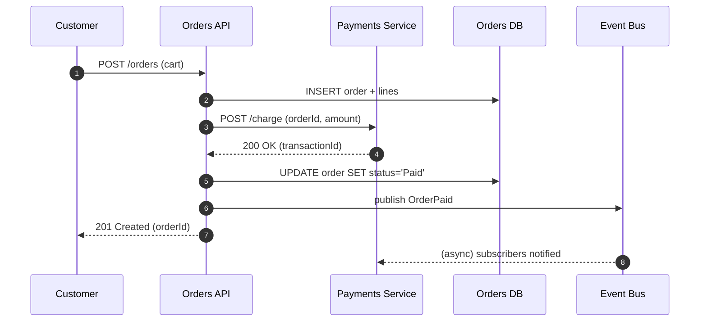
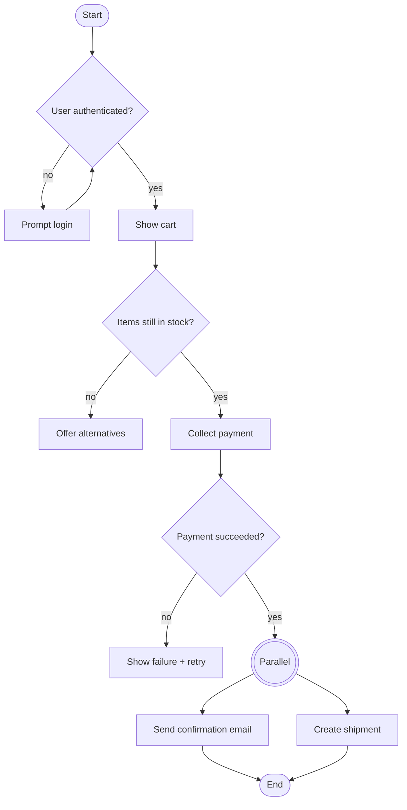
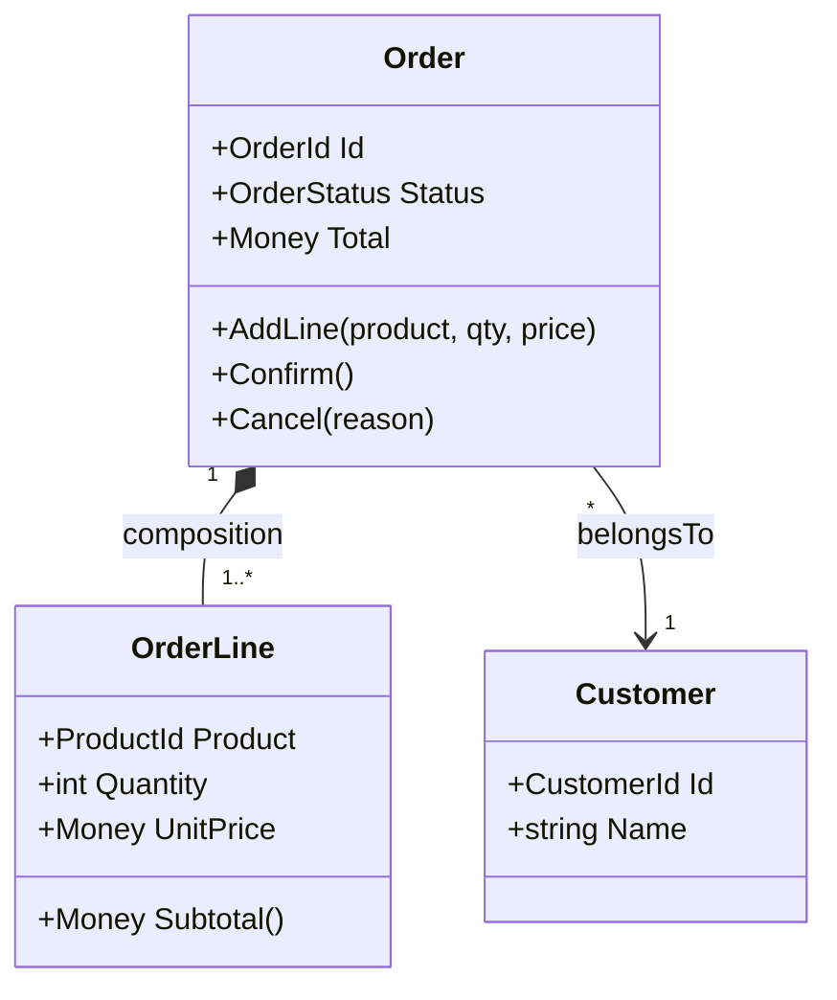
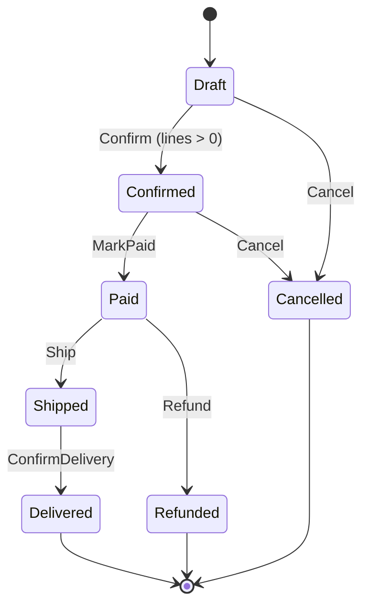
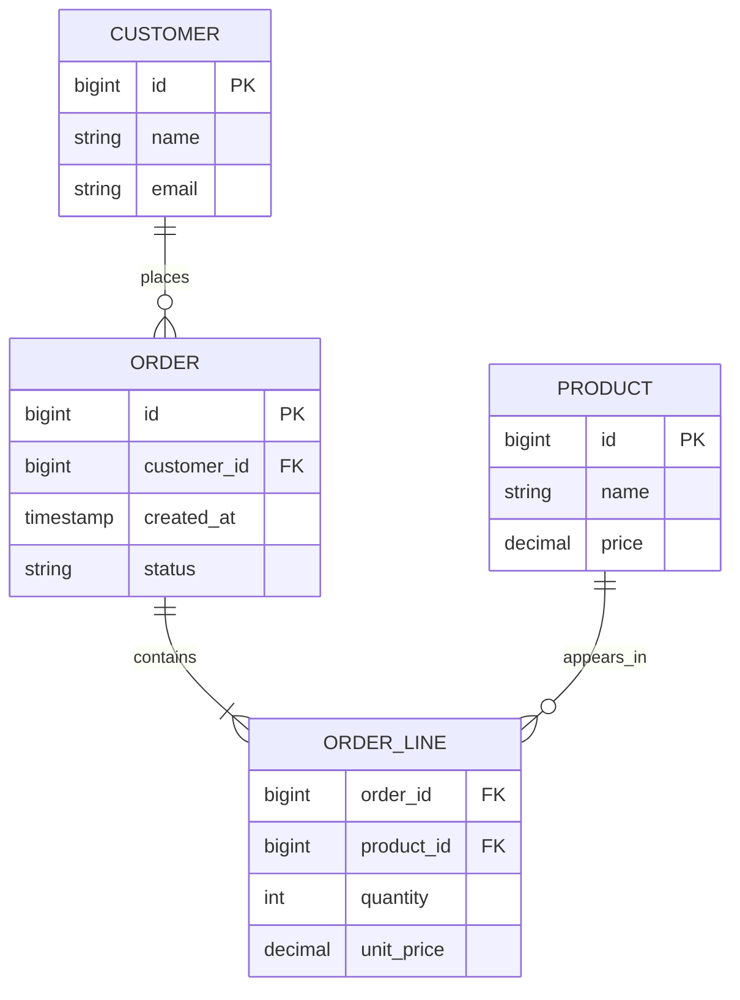

# UML Diagrams in Practice

UML — the Unified Modeling Language, standardized by the **Object Management Group (OMG)** since 1997 — is a family of diagram types for modeling software. In real teams almost nobody draws the full 14 official diagrams; you'll keep coming back to four or five of them. This file covers the ones worth knowing and the tools people actually use.

> Official spec: `omg.org/spec/UML`. Current version: UML 2.5.1.

## The diagrams you'll actually draw or read

| Diagram | Answers | Typical use |
|---|---|---|
| **Use case** | Who does what with the system? | Feature scoping, stakeholder discussion |
| **Sequence** | In what order do components/services talk? | Debugging distributed flows, documenting APIs |
| **Activity** | What's the business-process flow? | Workflow modeling, BPMN-lite |
| **Class** | What are the object types and how do they relate? | DDD aggregates, domain model docs |
| **Component** | What are the deployable parts and their dependencies? | Often replaced by C4 Container diagrams |
| **Deployment** | Where does the software actually run? | Infra reviews, prod-readiness checklists |
| **State** | How does one entity's state change? | Aggregates with complex state machines (Order, Shipment) |
| **ER** (not strictly UML) | How is the data structured? | Database schema reviews |

The rest (object, timing, interaction overview, etc.) are rarely worth the time to learn unless you hit them in a specific context.

## Use case diagrams

Who (actor) can do what (use case) with the system. Great for scoping discussions; not a substitute for acceptance criteria.

```
            ┌─────────────────────────────┐
            │        Online Store         │
            │                             │
            │   (Browse catalogue)        │
            │   (Place order)             │
 Customer ──│   (Track order)             │
            │   (Cancel order)            │
            │                             │
            │   (Manage inventory)        │── Admin
            │   (Configure pricing)       │
            └─────────────────────────────┘
```

**Notation basics:**
- Actors are stick figures outside the boundary; the system is a box.
- Use cases are verbs inside ellipses.
- `<<include>>` marks a required sub-use-case; `<<extend>>` marks an optional one.

**When to reach for it:** new feature kickoff, non-technical stakeholders, explaining the system's surface area.

## Sequence diagrams

Temporal order of messages between participants (components, services, actors). The vertical axis is time; each vertical line is a lifeline.

### Mermaid example — a payment flow



**Notation basics:**
- Solid arrow: synchronous call (waiting for response).
- Dashed arrow: return value or async message.
- `alt` / `opt` / `loop` frames for branches and repetition.
- `activation` bars (the thin rectangle on the lifeline) show when the participant is *doing work*.

**When to reach for it:** documenting a critical flow (payment, signup, login, saga), debugging a distributed problem, preparing an ADR.

## Activity diagrams

Business-process flow with decisions and parallelism. Think of it as a flowchart with formal semantics.

### Mermaid-equivalent (using `flowchart`)



**When to reach for it:** onboarding processes, workflows with parallel branches (fire-and-forget notifications), eliciting edge cases with stakeholders.

## Class diagrams

Types, attributes, operations, and relationships.



**Notation essentials:**
- `+` public, `-` private, `#` protected.
- Relationships: association (`-->`), aggregation (hollow diamond), composition (filled diamond), inheritance (`<|--`), realization of interface (`..|>`).
- Multiplicities: `1`, `0..1`, `1..*`, `*`.

**When to reach for it:** documenting an aggregate's internal structure, onboarding a developer to a domain module. Avoid for wide swathes of the codebase — it becomes noise.

## Component and deployment diagrams

Component diagrams show logical building blocks and their interfaces; deployment diagrams map those onto physical/virtual hardware (VMs, containers, regions).

> In modern practice these are usually better served by [C4 Container and Deployment views](17-design-docs-c4-adr.md#the-c4-model-simon-brown) — same intent, less notation overhead.

## State diagrams

The lifecycle of a single entity. Especially useful for aggregates in DDD.



**When to reach for it:** any aggregate with more than three states and forbidden transitions. The diagram doubles as a checklist for the state-machine code.

## Entity-Relationship (ER) diagrams

Technically Chen's notation (1976), not UML — but every team calls the data-model diagram "an ER" and so does tooling.



**Cardinality notation (Crow's Foot, the most common):**
- `||` exactly one
- `|o` zero or one
- `}o` zero or many
- `}|` one or many

**When to reach for it:** reviewing schema changes, modeling a new bounded context's persistence, teaching the database shape to a new team member.

## Tooling

| Tool | Strengths | Weaknesses |
|---|---|---|
| **Mermaid** | Lives in Markdown; GitHub renders it natively; fast to edit | Limited layout control; fewer diagram types than full UML |
| **PlantUML** | Every UML diagram; stable layouts; many integrations | Needs a rendering step (server or local) |
| **Structurizr** | C4-native, text-based; great for living architecture docs | C4-focused, not a full UML tool |
| **draw.io / diagrams.net** | Free-form, intuitive GUI | Not text-based — diagrams rot faster |
| **Lucidchart, Miro** | Collaborative, whiteboard-feel | Cloud-only, harder to diff in Git |

> **Prefer text-based formats** (Mermaid, PlantUML, Structurizr) over binary/image-only tools. Text diagrams live in the repo, get reviewed in PRs, and actually stay current.

## Pitfalls

- **UML pedantry.** Nobody will fail an interview because you used a solid arrow instead of a dashed one. Clear communication beats strict notation.
- **Big-bang "full system UML".** Pages of class diagrams documenting every internal class rot within weeks. Diagram only what aids communication.
- **Mixing abstraction levels.** One diagram showing customers, HTTP endpoints, DB tables, *and* internal classes — nobody can read it. Pick a level (C4 is explicit about this).
- **Forgetting the legend.** Shapes and arrows have meaning. If a reader has to guess, your diagram is a Rorschach test.
- **ER where every table is an entity.** Join tables are not entities — hide them in the relationship, don't clutter the canvas.

## Rule of thumb

> Draw a UML diagram when it answers a **specific question** someone is asking — "how does money flow?", "what happens if the payment fails?", "what are the order's states?" A diagram without a reader is just maintenance cost.

---

[← Previous: NFR-Driven Architecture](18-nfr-driven-architecture.md) | [Back to index](README.md)
